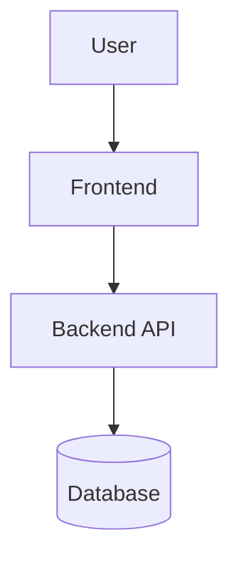

# {{Product Name}} — Architecture Summary

**Step 2 — Design** | One-screen overview
For the full technical expansion, see [ARCHITECTURE-deep.md](./ARCHITECTURE-deep.md).

---

## The picture

## What this does

*One sentence. What problem this architecture solves and the shape of the solution.*

## Key decisions

*Three bullets max. Each names the choice and the reason in plain language. If a fourth matters, it lives in the deep doc.*

- ***Decision:*** *e.g., "Managed Postgres via Supabase" — **Why:** "Free tier, no servers to operate, SQL we already know."*
- ***Decision:*** *…*
- ***Decision:*** *…*

## What this rules out

*One paragraph. The tradeoffs we accepted. What this architecture won't handle well, and what would need to change before it could.*

## What's next

- Full technical detail: [ARCHITECTURE-deep.md](./ARCHITECTURE-deep.md)
- What flows through these pieces: [DATA_MODEL-summary.md](./DATA_MODEL-summary.md)
- Security implications: [SECURITY_PRIVACY-summary.md](./SECURITY_PRIVACY-summary.md)

---

> **Claude Guidance:** This is the human-facing artifact. The user reads, signs off on, and remembers this file — not the deep doc. Keep it under one screen. If a section is growing, push detail into [ARCHITECTURE-deep.md](./ARCHITECTURE-deep.md) instead. The diagram is the headline; if it doesn't tell the story, redraw it before adding more prose.
