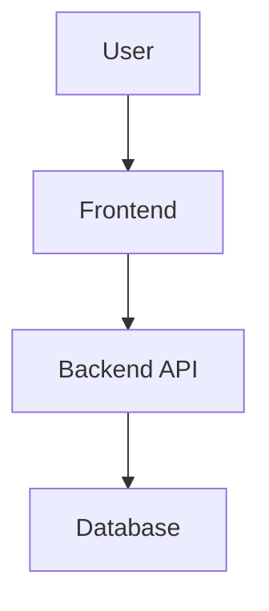

# ARCHITECTURE.md

**Level 2 — Design** | Contributed by: Product owner + technical collaborators

This document describes how the technical pieces of your product fit together: what systems exist, how they communicate, and why they're structured the way they are. It doesn't need to be exhaustive — it needs to be clear enough that someone new could understand the big picture and make decisions consistent with your choices.

---

> **Claude Guidance:** Start by asking the user what their product needs to do — don't assume a stack. Help them think through: Where does the product run? Does it need a backend? A database? Third-party services? Draw out the architecture in Mermaid before filling in prose. When choices involve tradeoffs (e.g., serverless vs. traditional backend), explain them in plain language and let the user decide. Avoid recommending a stack just because it's popular — recommend based on the user's constraints (skills, cost, scale).

---

## System Overview

*A one-paragraph summary of the overall architecture — what exists, how it fits together, and the key design philosophy (e.g., "simple and hosted", "event-driven", "mobile-first with a thin API layer").*

## Architecture Diagram

*A Mermaid diagram showing the major components and how they connect. Ask Claude to generate this.*

## Components

*For each major system or service, describe what it is, what it does, and why it exists.*

### Frontend

*What technology, where it runs, and what it's responsible for.*

### Backend / API

*What technology, where it runs, what it exposes, and what it's responsible for.*

### Data Storage

*Where data lives, what kind of store it is (relational, document, etc.), and why that choice fits the product.*

### External Services

*Third-party APIs, platforms, or services the product depends on, and what role each plays.*

## Key Technical Decisions

*The most important architectural choices made, and the reasoning behind them. Future Claude sessions should read this section before making implementation decisions.*

## Known Constraints and Tradeoffs

*What this architecture is not optimized for. What would need to change as the product scales.*

---

## Related

- [Design README](./README.md)
- [DATA_MODEL.md](./DATA_MODEL.md)
- [SECURITY_PRIVACY.md](./SECURITY_PRIVACY.md)
- [diagrams/](./diagrams/)
