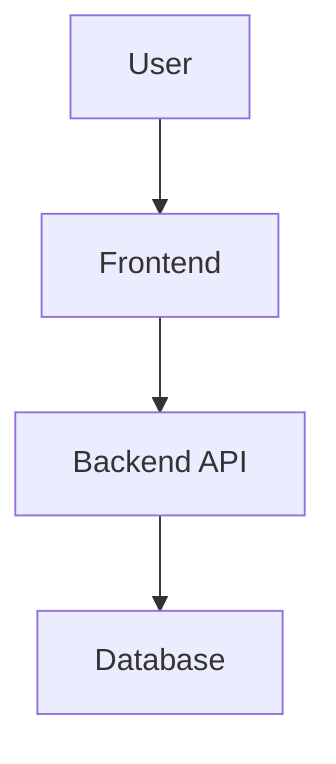

# ARCHITECTURE.md

**Step 2 — Design** | Contributed by: Product owner + technical collaborators

> **What is this?** An architecture document is like a blueprint for your software — it describes the major pieces of your product (the website, the database, any services it talks to) and how they connect. You don't need to be technical to fill this in; Claude will ask you questions and translate your answers into the right structure.

This document describes how the technical pieces of your product fit together: what systems exist, how they communicate, and why they're structured the way they are. It doesn't need to be exhaustive — it needs to be clear enough that someone new could understand the big picture and make decisions consistent with your choices.

---

> **Claude Guidance:** Start by reading the **Constraints & Values** section of `PRODUCT_OVERVIEW.md` before making any recommendations — the user's licensing intent, privacy stance, and infrastructure preference should shape every architectural suggestion.
>
> **Safety-first defaults:** Lead with the simplest, cheapest, least-infrastructure-heavy option that meets the product's needs. Explain what you're recommending and why, then offer more complex alternatives with their tradeoffs. Specifically:
> - Prefer **managed/hosted** services (Supabase, Vercel, Netlify, Railway, Neon) over self-hosted infrastructure — they reduce operational burden, often have generous free tiers, and handle security updates automatically
> - Prefer **fewer external services** — every third-party integration is a credential to manage, a potential outage, and a data-sharing decision
> - Prefer **established, well-maintained open-source libraries** over newer or proprietary ones — especially for auth, where rolling your own is dangerous
> - Flag **cost implications** clearly: free tiers, pricing cliffs, and what happens when the product scales
> - Flag **data residency and privacy implications** for any service that stores or processes user data
> - For **licensing compatibility**: check the user's chosen license against any dependencies — GPL/AGPL libraries in a closed-source product can be a problem
>
> Help the user think through: Where does the product run? Does it need a backend? A database? Third-party services? Draw out the architecture in Mermaid before filling in prose. When choices involve tradeoffs, explain them in plain language and let the user decide. Never recommend a stack just because it's popular — recommend based on the user's actual constraints (skills, cost, scale, privacy needs).

---

## System Overview

*A one-paragraph summary of the overall architecture — what exists, how it fits together, and the key design philosophy (e.g., "simple and hosted", "event-driven", "mobile-first with a thin API layer").*

## Architecture Diagram

*A Mermaid diagram showing the major components and how they connect. Ask Claude to generate this.*

## Components

*For each major system or service, describe what it is, what it does, and why it exists.*

### Frontend

*What technology, where it runs, and what it's responsible for.*

### Backend / API

*What technology, where it runs, what it exposes, and what it's responsible for.*

### Data Storage

*Where data lives, what kind of store it is (relational, document, etc.), and why that choice fits the product.*

### External Services

*Third-party APIs, platforms, or services the product depends on, and what role each plays.*

## Key Technical Decisions

*The most important architectural choices made, and the reasoning behind them. Future Claude sessions should read this section before making implementation decisions.*

## Known Constraints and Tradeoffs

*What this architecture is not optimized for. What would need to change as the product scales.*

---

## Related

- [Design README](./README.md)
- [DATA_MODEL.md](./DATA_MODEL.md)
- [SECURITY_PRIVACY.md](./SECURITY_PRIVACY.md)
- [LICENSING.md](./LICENSING.md)
- [diagrams/](./diagrams/)
