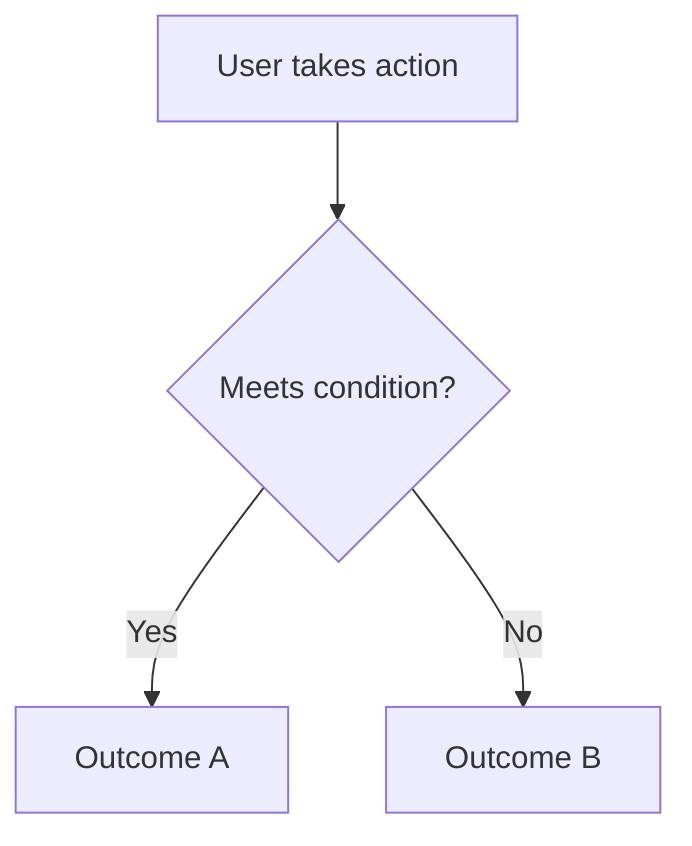

# BUSINESS_LOGIC.md

**Step 2 — Design** | Contributed by: Product owner, domain experts

> **What is this?** Business logic is the set of rules that make your product work the way it does — "free users can create up to 3 projects," "orders over $50 get free shipping," "only the event creator can cancel it." Writing these rules down in plain language before coding them prevents confusion later and makes sure Claude builds what you actually mean.

This document captures the rules, calculations, and domain-specific behavior that define how your product actually works under the hood. Business logic is often the hardest thing to reconstruct later — document it explicitly before it gets buried in code.

---

> **Claude Guidance:** Ask the user: "What are the rules your product enforces?" and "What happens when X?" for each core feature. Help them distinguish business rules (set by the product owner) from technical implementation details (set by an engineer). Document rules in plain language, not code. When rules have exceptions or edge cases, capture them. Use Mermaid flowcharts or decision trees for complex conditional logic. Flag rules that interact with `SECURITY_PRIVACY.md` (e.g., "only admins can delete records").

---

## Core Rules

*The fundamental rules that govern how the product behaves. These should be expressible in plain language. Example: "A user can only be enrolled in one active subscription at a time."*

## Calculations and Formulas

*Any math, scoring, ranking, pricing, or derived values the product computes. Show the formula and explain what each variable means.*

## Roles and Permissions

*Who can do what? Define user roles and the actions each role is permitted or prohibited from taking.*

| Role | Can | Cannot |
|------|-----|--------|
| | | |

## Decision Logic

*Conditional rules and branching behavior. Use a Mermaid flowchart for anything with more than two branches.*

## Edge Cases and Exceptions

*Cases where the normal rules don't apply, and what happens instead.*

## Rules That Must Never Be Violated

*Invariants — conditions that must always be true, regardless of the path taken to get there. These are the rules Claude should check before implementing any feature that touches this logic.*

---

## Related

- [Design README](./README.md)
- [USER_JOURNEYS.md](./USER_JOURNEYS.md)
- [SECURITY_PRIVACY.md](./SECURITY_PRIVACY.md)
- [DATA_MODEL.md](./DATA_MODEL.md)
