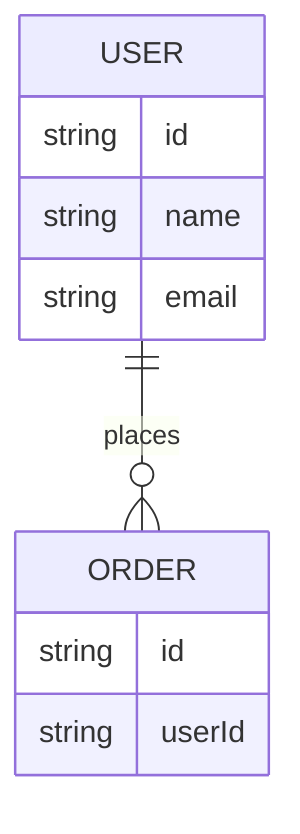

# DATA_MODEL.md

**Level 2 — Design** | Contributed by: Product owner + technical collaborators

This document defines the data your product stores, how it's structured, and how different pieces of data relate to each other. Getting this right before writing code prevents painful refactors later. Even a simple app benefits from thinking through its data model explicitly.

---

> **Claude Guidance:** Start by asking the user: "What are the main 'things' your product keeps track of?" Help them identify entities (users, posts, orders, etc.) before getting into fields. Generate an ERD in Mermaid once entities and relationships are identified. Ask about cardinality ("can a user have many orders, or just one?") in plain language. Flag any design choices that have privacy or security implications and link to `SECURITY_PRIVACY.md`. Avoid database-specific syntax in this document — keep it conceptual.

---

## Entities

*List the core "things" your product keeps track of. For each, describe what it represents and why it exists.*

### [Entity Name]

*What this entity represents, and what data it holds.*

| Field | Type | Description |
|-------|------|-------------|
| id | unique identifier | *Primary key* |
| | | |

## Relationships

*How entities connect to each other. Express in plain language: "A User can have many Orders. An Order belongs to exactly one User."*

## Entity Relationship Diagram

*A Mermaid ERD showing entities and their relationships. Ask Claude to generate this.*

## Data Access Patterns

*How will the product read and write data? What are the most common queries? This informs indexing and storage choices.*

## Data You Are NOT Storing

*Explicitly list data you are choosing not to collect or retain, and why. This is as important as what you do store.*

---

## Related

- [Design README](./README.md)
- [ARCHITECTURE.md](./ARCHITECTURE.md)
- [SECURITY_PRIVACY.md](./SECURITY_PRIVACY.md)
- [diagrams/](./diagrams/)
