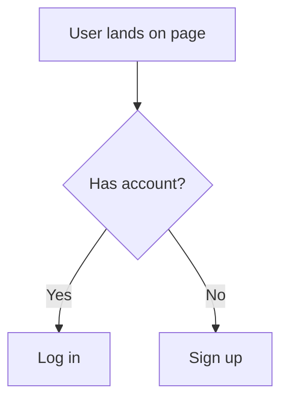

# USER_JOURNEYS.md

**Step 2 — Design** | Contributed by: Product owner, design, with Claude facilitation

> **What is this?** A user journey is a step-by-step walkthrough of what someone does in your product — like narrating a short story where the user is the main character. "First they see the landing page, then they click Sign Up, then they fill in their name..." Walking through these stories on paper catches confusing flows and missing screens before you build them.

This document maps out how users move through the key flows in your product — from first encounter to core actions. User journeys reveal gaps in logic, missing screens, and assumptions you didn't know you were making.

---

> **Claude Guidance:** Start by asking the user to name the 2–3 most important things a user needs to accomplish in their product. For each, walk through it step by step: "What does the user see first? What do they do next? What happens if something goes wrong?" Generate Mermaid flowcharts for each journey. Flag any steps where the user might drop off, get confused, or encounter a privacy concern. Surface decisions that should be reflected in `STYLE_GUIDE.md` or `SECURITY_PRIVACY.md`.

---

## Key User Journeys

*List the core flows to document. Examples: "New user sign-up", "Complete a purchase", "Edit and save a record", "Recover a forgotten password".*

---

### Journey: [Name]

*One sentence describing what the user is trying to accomplish.*

**User:** *Who is doing this? (e.g., new visitor, logged-in user, admin)*

**Starting point:** *Where does this journey begin?*

**Steps:**

1. *What the user sees or does*
2. *What the system does in response*
3. *(continue)*

**End state:** *What does success look like for the user?*

**Error states:** *What can go wrong, and what does the user see?*

**Flowchart:**

---

## Edge Cases and Exceptions

*Scenarios that don't fit the happy path but need to be handled — empty states, permission errors, timeouts, etc.*

---

## Related

- [Design README](./README.md)
- [STYLE_GUIDE.md](./STYLE_GUIDE.md)
- [BUSINESS_LOGIC.md](./BUSINESS_LOGIC.md)
- [diagrams/](./diagrams/)
