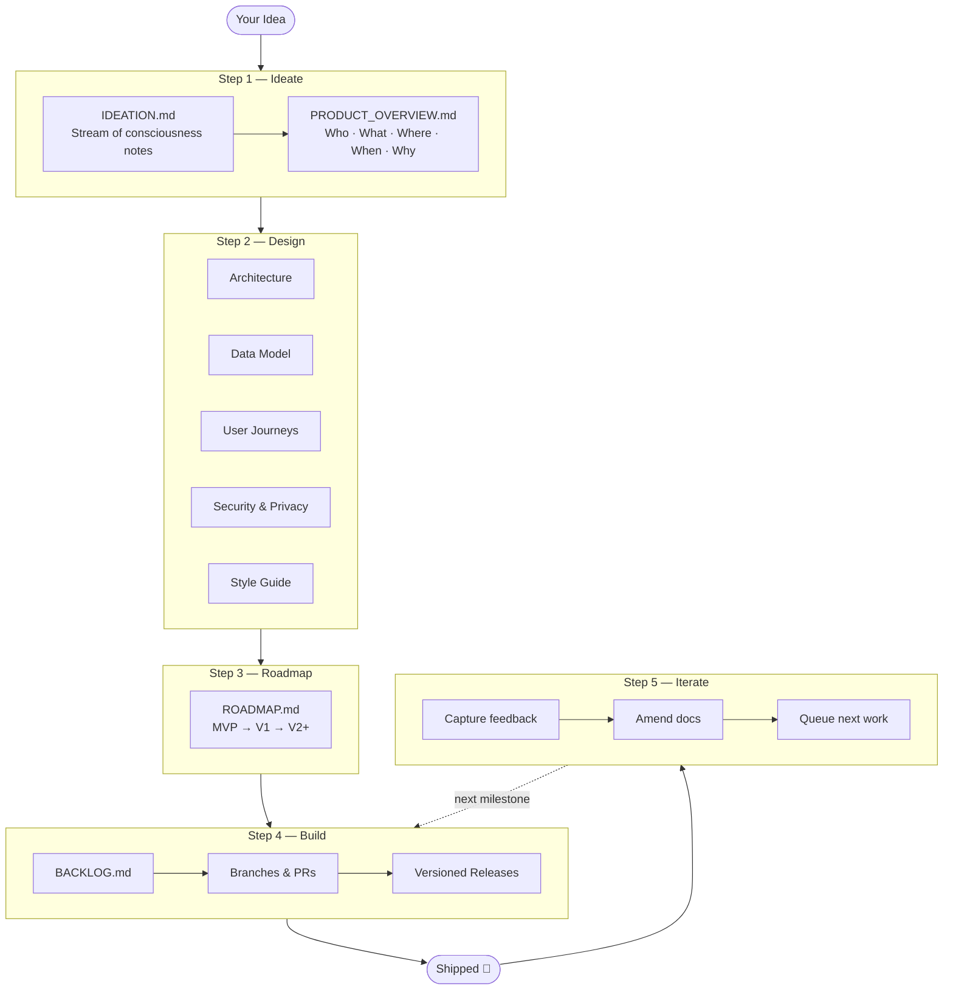

# hacky-hours-docs

A community framework for building apps with LLMs — the Hacky Hours way — created by [Empathetech](https://www.empathetech.org). 🛠️🤗

**For anyone who has an idea and wants to build it** — whether you've shipped a dozen products or you're writing your first line of code. No prior experience required. Just bring the idea.

This repo is two things at once:

1. **A documentation framework** — explains the Hacky Hours philosophy, five-step system, and best practices for LLM-assisted development
2. **A fork-able project template** — fork it, fill in the templates for your own project, and use the resulting docs as in-session context for Claude Code

---

## The Core Idea

You drive the product. Claude helps you build it — but it needs your direction, not just your instructions. This framework gives you the artifacts to provide that direction: who you're building for, what you're making, how it should work, and what values it should uphold.

The goal isn't to vibe-code without direction, and it isn't to get stuck in endless planning. It's to build with confidence, ownership, and growing expertise — one step at a time.

Imperfect documents are fine. Honest documents are what matter.

**This framework defaults to the safest, simplest path.** When Claude makes recommendations, it leads with free tools, minimal infrastructure, privacy-preserving defaults, and accessible design — and explains the tradeoffs before suggesting anything more complex. You can always choose a more powerful option, but you'll make that choice knowingly.

---

## How It Works

The diagram below shows the five steps — you start with an idea, work through each step, and ship. Step 5 loops back so you keep improving after each release.



Work through these steps in order. Each step's `README.md` explains what "done enough to move on" looks like.

---

## Five Steps

| Step | Folder | What happens here |
|------|--------|-------------------|
| 1 — Ideate | [`01-ideate/`](./01-ideate/) | Capture raw ideas → synthesize into a product overview |
| 2 — Design | [`02-design/`](./02-design/) | Define the product in detail: architecture, data, UX, security |
| 3 — Roadmap | [`03-roadmap/`](./03-roadmap/) | Prioritize features into MVP / V1 / V2+ milestones |
| 4 — Build | [`04-build/`](./04-build/) | Track tasks, manage releases, maintain a changelog |
| 5 — Iterate | _(loops back to Step 4)_ | Capture feedback, amend docs, queue the next round of work |

---

## Getting Started

**New to all of this?** Start here:
- [Getting started guide](./runbooks/getting-started/README.md) — choose your setup path (zero-install, local, or full terminal)
- [What is a terminal?](./runbooks/getting-started/00-what-is-a-terminal.md) — if that question even crossed your mind
- [What will this cost?](./runbooks/costs.md) — a plain-language cost breakdown
- [FAQ](./runbooks/FAQ.md) — answers to the most common questions

**Ready to build something?**
1. Fork this repo → clone it → open it in VS Code or Codespaces
2. Open [`01-ideate/IDEATION.md`](./01-ideate/IDEATION.md) and start writing
3. Use the [starter prompts](./runbooks/starter-prompts/) to kick off each Claude session
4. Check the [`example/`](./example/) folder to see what completed documents look like

---

## Resources

| Resource | What it is |
|----------|-----------|
| [`example/`](./example/) | A completed fictional project (NeighborBoard) showing what filled-in documents look like |
| [`runbooks/starter-prompts/`](./runbooks/starter-prompts/) | Copy-paste prompts to start Claude sessions at each step |
| [`GLOSSARY.md`](./GLOSSARY.md) | Plain-language definitions for every technical term |
| [`runbooks/costs.md`](./runbooks/costs.md) | What this will cost you |
| [`runbooks/FAQ.md`](./runbooks/FAQ.md) | Frequently asked questions |
| [`runbooks/getting-started/`](./runbooks/getting-started/) | Setup guides for all platforms and skill levels |
| [`runbooks/document-hygiene.md`](./runbooks/document-hygiene.md) | How to keep docs lean as your project grows (archiving, `.claudeignore`, ADRs) |
| [`runbooks/github-action-sync.md`](./runbooks/github-action-sync.md) | Auto-sync BACKLOG and CHANGELOG when PRs merge via GitHub Action |
| [`runbooks/cross-tool-usage.md`](./runbooks/cross-tool-usage.md) | Using the framework in Cursor, Windsurf, Claude.ai Projects, or any LLM tool |

---

## Use as a Claude Code Command (if you already have Claude Code set up)

> If you're new to Claude Code, start with the [getting started guide](./runbooks/getting-started/README.md) first — this section is for people who already have it installed and running.

Install `/hacky-hours` as a slash command so it works in **any repo you open** — no cloning required. A slash command is a shortcut you type in a Claude Code session (like `/hacky-hours step 1`) that gives Claude a specific workflow to follow.

**macOS / Linux:**
```bash
curl -fsSL https://raw.githubusercontent.com/empathetech/hacky-hours-docs/main/install.sh | bash
```

**Windows (PowerShell):**
```powershell
irm https://raw.githubusercontent.com/empathetech/hacky-hours-docs/main/install.ps1 | iex
```

Then type `/hacky-hours` in any Claude Code session. See [`runbooks/install-as-command.md`](./runbooks/install-as-command.md) for full instructions, including the complete argument list (`step`, `review`, `learn`, `update`, `tools`, `--root`, and more).

> **Upgrading from v1.x?** Run `/hacky-hours tools upgrade` after installing — it detects what's changed and shows you exactly what it plans to update before touching anything.

---

## Command Reference

Once installed, type `/hacky-hours [command]` in any Claude Code session.

**Work the framework**

| Command | What it does |
|---------|-------------|
| `/hacky-hours` | Survey your project and report where you are |
| `/hacky-hours step 1` | Step 1 — Ideation |
| `/hacky-hours step 2` | Step 2 — Design |
| `/hacky-hours step 3` | Step 3 — Roadmap |
| `/hacky-hours step 4` | Step 4 — Build |
| `/hacky-hours step 5` | Step 5 — Iterate (post-release cycle) |
| `/hacky-hours step 0` | Explore without writing any files |

**Review your project**

| Command | What it does |
|---------|-------------|
| `/hacky-hours review 1` | Did we follow best practices? |
| `/hacky-hours review 2` | Did we build it well? |
| `/hacky-hours review 3` | Should we build something else? |

**Onboard and transfer knowledge**

| Command | What it does |
|---------|-------------|
| `/hacky-hours learn 1` | Tour — big-picture walkthrough |
| `/hacky-hours learn 2` | Onboard — hands-on starter task |
| `/hacky-hours learn 3` | Quiz — test your knowledge |

**Ship and track**

| Command | What it does |
|---------|-------------|
| `/hacky-hours update 1` | Publish a new release |
| `/hacky-hours update 2` | Sync BACKLOG ↔ GitHub Issues |

**Framework tools**

| Command | What it does |
|---------|-------------|
| `/hacky-hours tools upgrade` | Update framework artifacts (also: adopt an existing codebase, migrate old layout) |
| `/hacky-hours tools mode` | Toggle between plain-language and technical mode |
| `/hacky-hours tools walkthrough` | How all commands work together |
| `/hacky-hours help` | Full help message |

Named aliases work too — `/hacky-hours step ideate`, `/hacky-hours review audit`, etc. All commands accept `--root <path>` to operate in a subdirectory.

---

## Using This Repo as a Resource in Another Project (advanced)

> This is for people who already have an existing codebase and want to add the Hacky Hours framework to it. If you're starting fresh, just fork this repo — see the [getting started guide](./runbooks/getting-started/README.md).

You can import this framework into any project so Claude can reference it as in-session context. See [`runbooks/using-this-repo/import-as-resource.md`](./runbooks/using-this-repo/import-as-resource.md) for three approaches, from most to least recommended.

---

## Contributing

All contributions are Markdown files. See [`runbooks/using-this-repo/contributing.md`](./runbooks/using-this-repo/contributing.md) for guidelines.

This is a living document base — it grows as the community learns. If you find a pattern that works or a gap that needs filling, contribute it back.
