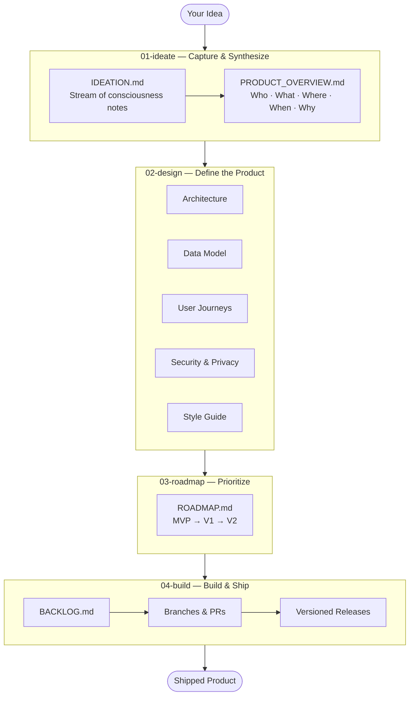

# hacky-hours-docs

A community framework for building apps with LLMs — the Hacky Hour way — created by [Empathetech](https://www.empathetech.org).

This repo is two things at once:

1. **A documentation framework** — explains the Hacky Hours philosophy, four-level system, and best practices for LLM-assisted development
2. **A fork-able project template** — fork it, fill in the templates for your own project, and use the resulting docs as in-session context for Claude Code

---

## The Core Idea

You are the C-suite of your product. Claude and other LLMs are a highly capable implementation team — but they need alignment, not just instructions. This framework gives you the artifacts to provide that alignment: who you are, what you're building, how it should work, and what values it should uphold.

The goal is not to vibe-code blindly, and not to be paralyzed by fear. It's to build with confidence, ownership, and growing expertise.

---

## How It Works



Work through these levels in order. Each level's `README.md` explains what "done enough to move on" looks like.

---

## Four Levels

| Level | Folder | What happens here |
|-------|--------|-------------------|
| 1 — Ideation | [`01-ideate/`](./01-ideate/) | Capture raw ideas → synthesize into a product overview |
| 2 — Design | [`02-design/`](./02-design/) | Define the product in detail: architecture, data, UX, security |
| 3 — Roadmap | [`03-roadmap/`](./03-roadmap/) | Prioritize features into MVP / V1 / V2 milestones |
| 4 — Build | [`04-build/`](./04-build/) | Track tasks, manage releases, maintain a changelog |

---

## Getting Started

**New to all of this?** Start here:
- [Getting started guide](./runbooks/getting-started/README.md) — choose your setup path (zero-install, local, or full terminal)
- [What is a terminal?](./runbooks/getting-started/00-what-is-a-terminal.md) — if that question even crossed your mind
- [What will this cost?](./runbooks/costs.md) — a plain-language cost breakdown
- [FAQ](./runbooks/FAQ.md) — answers to the most common questions

**Ready to build something?**
1. Fork this repo → clone it → open it in VS Code or Codespaces
2. Open [`01-ideate/IDEATION.md`](./01-ideate/IDEATION.md) and start writing
3. Use the [starter prompts](./runbooks/starter-prompts/) to kick off each Claude session
4. Check the [`example/`](./example/) folder to see what completed documents look like

---

## Resources

| Resource | What it is |
|----------|-----------|
| [`example/`](./example/) | A completed fictional project (NeighborBoard) showing what filled-in documents look like |
| [`runbooks/starter-prompts/`](./runbooks/starter-prompts/) | Copy-paste prompts to start Claude sessions at each level |
| [`GLOSSARY.md`](./GLOSSARY.md) | Plain-language definitions for every technical term |
| [`runbooks/costs.md`](./runbooks/costs.md) | What this will cost you |
| [`runbooks/FAQ.md`](./runbooks/FAQ.md) | Frequently asked questions |
| [`runbooks/getting-started/`](./runbooks/getting-started/) | Setup guides for all platforms and skill levels |

---

## Use as a Claude Code Command

Install `/hacky-hours` as a global Claude Code slash command so it works in **any repo you open** — not just this one.

```bash
mkdir -p ~/.claude/commands
cp /path/to/hacky-hours-docs/.claude/commands/hacky-hours.md ~/.claude/commands/hacky-hours.md
```

Then type `/hacky-hours` in any Claude Code session to launch the guided framework workflow. See [`runbooks/install-as-command.md`](./runbooks/install-as-command.md) for full instructions (Windows, updating, uninstalling).

---

## Using This Repo as a Resource in Another Project

You can import this framework into any project so Claude can reference it as in-session context. See [`runbooks/using-this-repo/import-as-resource.md`](./runbooks/using-this-repo/import-as-resource.md) for three approaches:
- Git submodule (recommended)
- CLAUDE.md reference snippet
- Manual copy

---

## Contributing

All contributions are Markdown files. See [`runbooks/using-this-repo/contributing.md`](./runbooks/using-this-repo/contributing.md) for guidelines.

This is a living document base — it grows as the community learns. If you find a pattern that works or a gap that needs filling, contribute it back.
