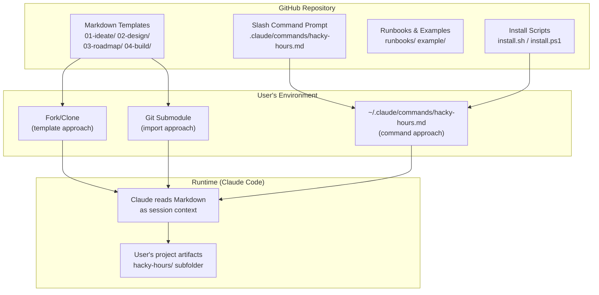
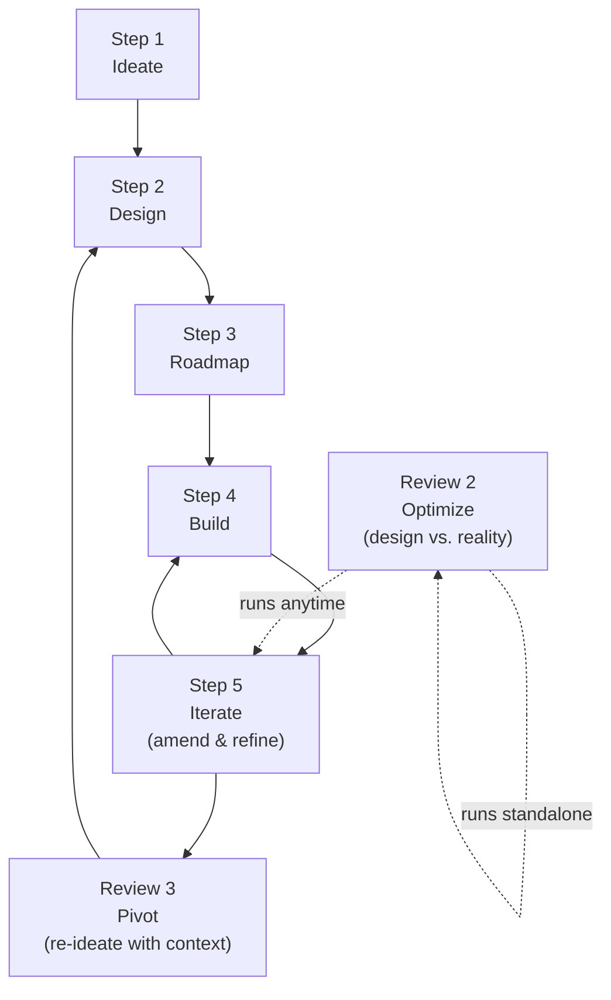

# ARCHITECTURE.md

**Step 2 — Design** | hacky-hours-docs

---

## System Overview

hacky-hours-docs is a zero-infrastructure documentation framework. There is no build system, no package manager, no test suite, and no runtime. The entire product is Markdown files. The "execution environment" is Claude Code reading these files as session context and acting on the embedded guidance.

## Architecture Diagram



## Delivery Mechanisms

### 1. Fork/Clone (template approach)
User forks the repo, deletes the example content, and fills in templates with their own product information. The root-level `01-ideate/`, `02-design/`, etc. folders serve as the templates.

### 2. Slash Command (primary approach)
User runs the install script, which copies the command prompt file to `~/.claude/commands/hacky-hours.md`. The command is then available as `/hacky-hours` in any Claude Code session. The command scaffolds a `hacky-hours/` subfolder in whatever repo the user is working in.

### 3. Git Submodule (import approach)
User adds this repo as a submodule and references it in their project's `CLAUDE.md`. Templates are available as read-only context.

## Key Components

| Component | Location | Purpose |
|-----------|----------|---------|
| Framework templates | `01-ideate/`, `02-design/`, `03-roadmap/`, `04-build/` | Blank templates users fill in |
| Slash command prompt | `.claude/commands/hacky-hours.md` | The guided assistant — routes arguments, scaffolds, facilitates |
| Example project | `example/` | Completed fictional project (NeighborBoard) showing filled-in docs |
| Runbooks | `runbooks/` | Getting started guides, starter prompts, setup instructions |
| Install scripts | `install.sh`, `install.ps1` | One-command install for macOS/Linux and Windows |
| Glossary | `GLOSSARY.md` | Plain-language definitions for technical terms |

## Lifecycle Model

The framework's lifecycle is a five-step cycle (non-linear as of v1.5.0, see [ADR: Non-Linear Lifecycle](decisions/2026-03-30-non-linear-lifecycle.md); step language introduced in v2.0.0, see [ADR: v2.0.0 Command Surface Redesign](decisions/2026-04-11-v2-command-surface-redesign.md)):



- **Step 5 (iterate)** — product direction is sound; amend docs, triage feedback, build next
- **review 3 (pivot)** — product direction needs rethinking; re-ideate with full context, cascade changes through Steps 2–4
- **review 2 (optimize)** — substantive review comparing design intent against current reality; proposes specific fixes; standalone or as an iterate phase

## Learn Suite (v1.8.0)

Three commands for knowledge transfer and onboarding, grouped under `/hacky-hours learn [tour|onboard|quiz]`:

| Mode | Purpose |
|------|---------|
| `tour` | Guided walkthrough of the project — scoped to the user's focus (design, architecture, data model, or full) |
| `onboard` | Task scoping for engineers new to an area — proposes a starter task, optionally creates a GitHub Issue |
| `quiz` | Knowledge verification — broad or scoped to a specific area |

**Design principle:** Conversation mode (Claude Code) is the baseline for all three — always available, no dependencies. Static site generation (Astro) is an optional richer layer on top. Both deliver the same content; the site is a better presentation, not a different experience.

**Feedback loop:** The tour site includes a markdown editor where readers can submit notes. Submissions are saved as `hacky-hours/feedback/feedback-<username>-<timestamp>.md`. The `onboard` command commits and pushes any generated feedback file on wrap-up, and optionally opens a GitHub Issue. The `iterate` Step 1 Capture checks `hacky-hours/feedback/` as a new input source.

**New scaffold artifacts introduced:**

| Folder | Contents | Gitignored? |
|--------|----------|-------------|
| `hacky-hours/learn/tour/` | Generated general tour site | No (permanent) |
| `hacky-hours/learn/quiz/` | Generated general quiz site | No (permanent) |
| `hacky-hours/learn/personal/` | Personalized tours/quizzes scoped to `<username>` | Yes (temp until promoted) |
| `hacky-hours/feedback/` | User-submitted feedback files | No (persisted and pushed) |

Both `hacky-hours/learn/` and `hacky-hours/feedback/` are excluded from Claude context via `.claudeignore` by default — they're generated assets and user input, not planning docs.

## Static Site Generation (v1.8.0)

As of v1.8.0, some commands can optionally generate a static site alongside the conversation output. This is a new output type for the framework.

**Stack: Astro**

Chosen for:
- **Markdown-native content collections** — generated content lives in `.md` files; regenerating means updating Markdown, not HTML
- **Islands architecture** — interactive features (feedback form markdown editor, quiz UI) are scoped components; the rest of the site is static
- **No custom build logic to maintain** — Astro handles the HTML output; the command maintains only content files

**Requirement:** Node.js must be installed. The command checks for this before attempting site generation and falls back gracefully to conversation mode if Node is unavailable.

**Site structure:**

```
hacky-hours/learn/
  tour/           ← Astro project: general tour site
  quiz/           ← Astro project: general quiz site
  personal/       ← gitignored; one subfolder per <username>
hacky-hours/feedback/
  feedback-<username>-<timestamp>.md
```

## Upgrade Command (v1.8.0)

`tools upgrade` bridges the gap between updating the command and updating the user's project artifacts.

**What it does:**
1. Reads the installed command version from the routing table
2. Checks for a version marker in the user's `CLAUDE.md` or scaffold (set by previous upgrade runs)
3. Diffs what the current version expects against what exists in the user's `hacky-hours/` folder — new doc templates, new scaffold folders, new `.claudeignore` entries
4. Presents a plain-language list of what's new and what to adopt
5. Confirms before writing anything

**Scope boundary:** `upgrade` operates on the user's own project artifacts only. It does not pull from upstream or modify the command prompt itself. This makes it safe for forked repos with custom modifications.

**Note:** `migrate` (v0.x → v1.0 folder restructure) is absorbed into `upgrade` as a step it detects and handles automatically. The standalone `migrate` command is deprecated as of v1.8.0.

## Voice Mode

As of v1.7.0, the command supports a persistent voice mode that controls conversation style across sessions.

- **Default:** non-technical — tradeoffs explained through outcomes, analogies, and consequences; no jargon without plain-language definition
- **Engineer:** opt-in — spec-aware, ecosystem-aware, tradeoff-precise; assumes familiarity with technical vocabulary

**How it works:**

The `tools mode` command toggles between voices and writes the current mode to a `## Hacky Hours Voice` section in the project's `CLAUDE.md`. On session start, the command reads this section and applies the mode. If no section is present, non-technical is assumed.

Scaffolding writes `## Hacky Hours Voice: non-technical` to `CLAUDE.md` by default.

Voice mode affects conversation style only — it does not change which documents get created, which questions get asked, or how rigorously design decisions are evaluated.

## GitHub Issues Integration

Two-way sync between BACKLOG.md and GitHub Issues (see [ADR: Two-Way Sync](decisions/2026-03-30-issues-two-way-sync.md)):

- **Push:** BACKLOG.md → Issues (create, update)
- **Pull:** Issues → BACKLOG.md (propose additions)
- **Conflict model:** Last-write-wins with diff shown to user; human confirms every change
- **Identity:** `#<number>` in BACKLOG.md, `[hacky-hours]` label on Issues
- **Invocation:** `update 2`

## Known Fragility

The skill entrypoint (`.claude/skills/hacky-hours-dev/SKILL.md`) is the most complex component. As of v3.0.0, the skill is broken into a small entrypoint (~600 lines, down from ~1,500) plus per-step / per-review / per-tool supporting files that load only when invoked. Per-file size should be monitored after each release; if any single supporting file grows past ~500 lines, consider splitting it further.

Remaining fragility:
- **No gradual rollout** — changes to the skill affect every user on next install. There is no canary or staged release mechanism.
- **Top-level directory watch on first install** — Claude Code requires a restart for newly created top-level `.claude/skills/` directories to be watched. Users upgrading from v2.x must restart once after their first v3.0.0 install. The installer surfaces this in its final message but it is still a manual step.
- **Cross-tool portability** — the skill is Claude Code–specific. Other tools (Cursor, Windsurf) get framework behavior through CLAUDE.md project instructions, not the skill itself. The two surfaces need to stay in sync.
- **Breaking changes on major versions** — v2.0.0 broke all v1.x command entry points; v3.0.0 changes the install path. Users must relearn paths or re-run installers after each major version. The `tools upgrade` command mitigates this for CLAUDE.md references, but there is no automated migration for user muscle memory.
- **Node.js dependency (v1.8.0)** — static site generation requires Node.js. The conversation-first design means the framework degrades gracefully without it, but this is the first external runtime dependency the framework has introduced. Worth monitoring whether it creates friction.

## Release Process

As of v3.0.0, the framework ships as a Claude Code Skill (directory tree), not a single slash command file:

| Path | Purpose |
|------|---------|
| `.claude/skills/hacky-hours-dev/` | Development version, used when working in this repo |
| `~/.claude/skills/hacky-hours/` | Installed version, used in any other repo |

Each is a directory containing `SKILL.md` (entrypoint) plus subdirectories: `steps/`, `reviews/`, `learn/`, `update/`, `tools/`, `templates/design/`. SKILL.md routes to supporting files via `${CLAUDE_SKILL_DIR}` so per-step content loads only when invoked.

**How a release works:**

1. All development happens in `.claude/skills/hacky-hours-dev/` — the SKILL.md frontmatter description includes "(dev)" and `name: hacky-hours-dev`
2. When ready to release, bump the version string in two places:
   - SKILL.md frontmatter description
   - SKILL.md help message: `Hacky Hours framework assistant — vX.Y.Z`
3. Bump version markers in `tools/upgrade.md` (the `<!-- hacky-hours: vX.Y.Z -->` template and the upgrade-complete report message)
4. Commit, tag (`vX.Y.Z`), push, publish GitHub Release
5. Users re-run `install.sh` / `install.ps1`. The installer downloads the repo tarball, extracts `.claude/skills/hacky-hours-dev/`, places it at `~/.claude/skills/hacky-hours/`, transforms the SKILL.md frontmatter (`name: hacky-hours-dev` → `hacky-hours`, strips "(dev)" from description), and removes any stale v2.x `~/.claude/commands/hacky-hours.md`
6. Users restart Claude Code so the new top-level `.claude/skills/` directory is watched (one-time per machine on first v3.0.0 install)

**What constitutes a version bump:**
- **Patch (x.y.Z):** Bug fixes, wording improvements, no new arguments
- **Minor (x.Y.0):** New arguments, new workflow sections, new scaffold files
- **Major (X.0.0):** Breaking changes to existing artifact format or argument behavior

## Cross-Tool Support

The `/hacky-hours` slash command is a Claude Code convenience. The actual framework runs on two things:

1. **The Markdown artifacts** (`hacky-hours/` folder) — these work in any tool
2. **The CLAUDE.md project state machine** — any tool that reads project instructions (Cursor, Windsurf, Claude.ai Projects) picks this up automatically

Users in non-Claude-Code environments interact with the framework through natural language ("help me with ideation", "what's in my backlog?") instead of slash commands. The CLAUDE.md instructions guide Claude's behavior the same way.

## Design Decisions

*Future decisions should be recorded in `02-design/decisions/`.*
