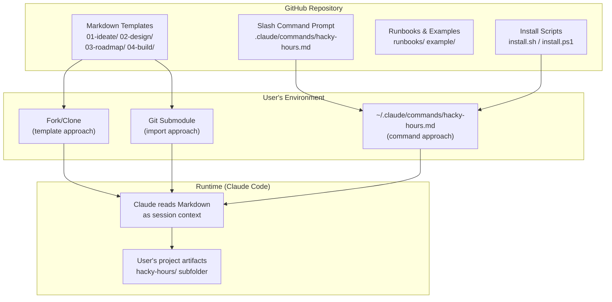
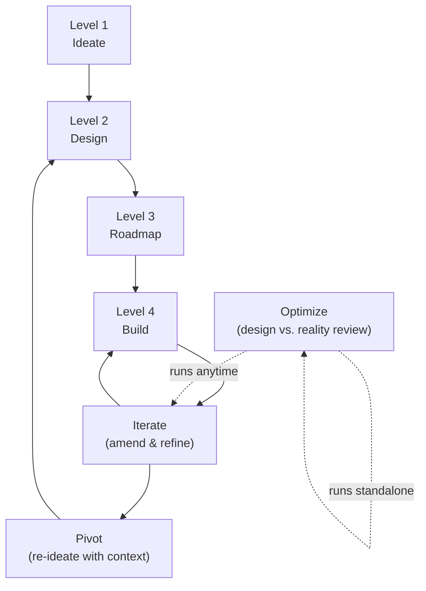

# ARCHITECTURE.md

**Level 2 — Design** | hacky-hours-docs

---

## System Overview

hacky-hours-docs is a zero-infrastructure documentation framework. There is no build system, no package manager, no test suite, and no runtime. The entire product is Markdown files. The "execution environment" is Claude Code reading these files as session context and acting on the embedded guidance.

## Architecture Diagram

## Delivery Mechanisms

### 1. Fork/Clone (template approach)
User forks the repo, deletes the example content, and fills in templates with their own product information. The root-level `01-ideate/`, `02-design/`, etc. folders serve as the templates.

### 2. Slash Command (primary approach)
User runs the install script, which copies the command prompt file to `~/.claude/commands/hacky-hours.md`. The command is then available as `/hacky-hours` in any Claude Code session. The command scaffolds a `hacky-hours/` subfolder in whatever repo the user is working in.

### 3. Git Submodule (import approach)
User adds this repo as a submodule and references it in their project's `CLAUDE.md`. Templates are available as read-only context.

## Key Components

| Component | Location | Purpose |
|-----------|----------|---------|
| Framework templates | `01-ideate/`, `02-design/`, `03-roadmap/`, `04-build/` | Blank templates users fill in |
| Slash command prompt | `.claude/commands/hacky-hours.md` | The guided assistant — routes arguments, scaffolds, facilitates |
| Example project | `example/` | Completed fictional project (NeighborBoard) showing filled-in docs |
| Runbooks | `runbooks/` | Getting started guides, starter prompts, setup instructions |
| Install scripts | `install.sh`, `install.ps1` | One-command install for macOS/Linux and Windows |
| Glossary | `GLOSSARY.md` | Plain-language definitions for technical terms |

## Lifecycle Model

The framework's lifecycle is non-linear (as of v1.5.0, see [ADR: Non-Linear Lifecycle](decisions/2026-03-30-non-linear-lifecycle.md)):

- **iterate** — product direction is sound; amend docs, triage feedback, build next
- **pivot** — product direction needs rethinking; re-ideate with full context, cascade changes through Levels 2-4
- **optimize** — substantive review comparing design intent against current reality; proposes specific fixes; standalone or as an iterate phase

## GitHub Issues Integration

Two-way sync between BACKLOG.md and GitHub Issues (see [ADR: Two-Way Sync](decisions/2026-03-30-issues-two-way-sync.md)):

- **Push:** BACKLOG.md → Issues (create, update)
- **Pull:** Issues → BACKLOG.md (propose additions)
- **Conflict model:** Last-write-wins with diff shown to user; human confirms every change
- **Identity:** `#<number>` in BACKLOG.md, `[hacky-hours]` label on Issues
- **Invocation:** `/hacky-hours sync --issues`

## Known Fragility

The slash command prompt (`.claude/commands/hacky-hours-dev.md`) is the most complex component (~1600 lines, ~8.6K estimated tokens). As of v1.1.0, the command has been harmonized: all workflow sections follow consistent patterns (context preambles, done-when criteria), the scaffold and adopt flows produce matching file structures, and subcommand help documents every argument.

Remaining fragility:
- **No gradual rollout** — changes to the command prompt affect every user on next install. There is no canary or staged release mechanism.
- **Single-file architecture** — all routing, guidance, and workflow logic lives in one markdown file. As features grow, this file gets harder to review and reason about.
- **Cross-tool portability** — the slash command is Claude Code–specific. Other tools (Cursor, Windsurf) get framework behavior through CLAUDE.md project instructions, not the command itself. The two surfaces need to stay in sync.

## Release Process

The command prompt has two versions:

| File | Purpose |
|------|---------|
| `.claude/commands/hacky-hours-dev.md` | Development version, used when working in this repo |
| `~/.claude/commands/hacky-hours.md` | Installed version, used in any other repo |

**How a release works:**

1. All development happens in `hacky-hours-dev.md` (description includes "(dev)")
2. When ready to release, bump the version string in three places:
   - Routing table: `print "Hacky Hours command vX.Y.Z"`
   - Help message: `Hacky Hours framework assistant — vX.Y.Z`
   - Subcommand help audit section (if version-specific)
3. Commit, tag (`vX.Y.Z`), push, publish GitHub Release
4. The install script (`install.sh` / `install.ps1`) downloads `hacky-hours-dev.md` from `main`, strips "(dev)" from the description, and saves it as `hacky-hours.md`

**What constitutes a version bump:**
- **Patch (x.y.Z):** Bug fixes, wording improvements, no new arguments
- **Minor (x.Y.0):** New arguments, new workflow sections, new scaffold files
- **Major (X.0.0):** Breaking changes to existing artifact format or argument behavior

## Cross-Tool Support

The `/hacky-hours` slash command is a Claude Code convenience. The actual framework runs on two things:

1. **The Markdown artifacts** (`hacky-hours/` folder) — these work in any tool
2. **The CLAUDE.md project state machine** — any tool that reads project instructions (Cursor, Windsurf, Claude.ai Projects) picks this up automatically

Users in non-Claude-Code environments interact with the framework through natural language ("help me with ideation", "what's in my backlog?") instead of slash commands. The CLAUDE.md instructions guide Claude's behavior the same way.

## Design Decisions

*Future decisions should be recorded in `02-design/decisions/`.*
